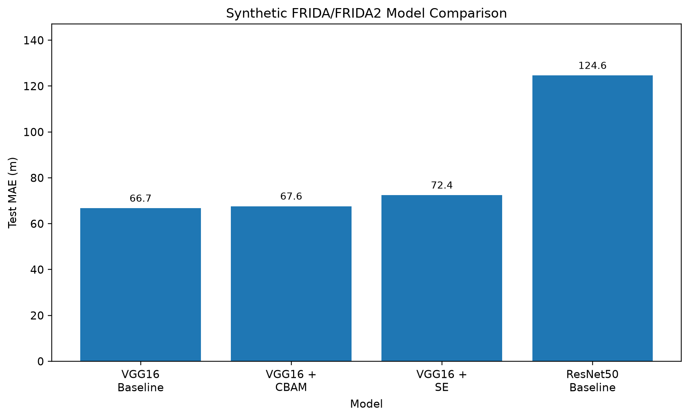
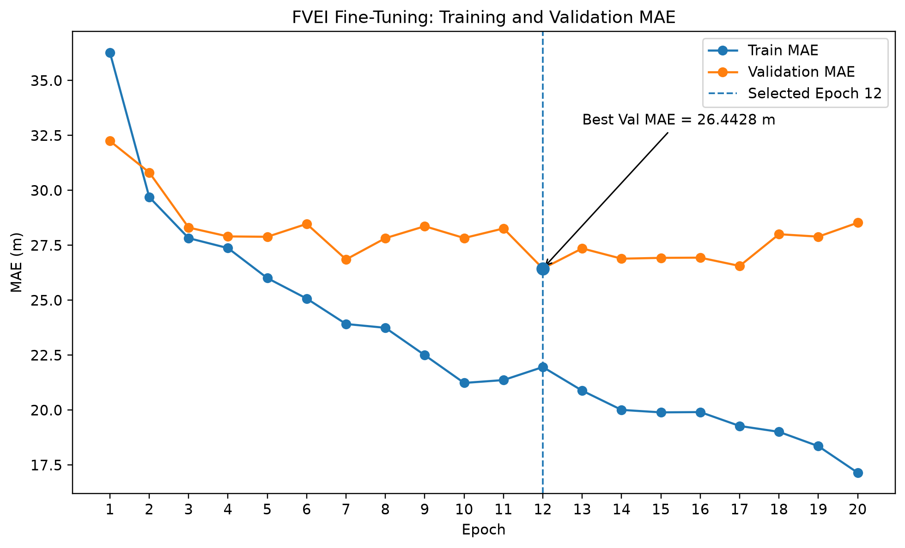
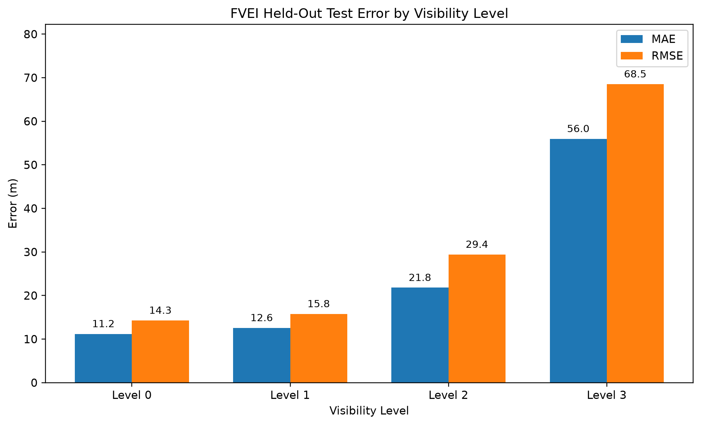

# 2209/A ÜNİVERSİTE ÖĞRENCİLERİ ARAŞTIRMA PROJELERİ DESTEK PROGRAMI
# SONUÇ RAPORU

## PROJE BAŞLIĞI

**Transfer Öğrenme Temelli CNN Mimarilerinin Görüş Mesafesi Tahmininde Karşılaştırmalı Analizi**

**PROJE YÜRÜTÜCÜSÜNÜN ADI:** İlayda Öztürk

**DANIŞMANININ ADI:** Songül Karakuş

---

# GENEL BİLGİLER

| Alan | Bilgi |
|---|---|
| **Projenin Konusu** | Sisli hava koşullarında transfer öğrenme tabanlı CNN mimarileri kullanılarak görüntüden görüş mesafesi tahmini |
| **Proje Yürütücüsünün Adı** | İlayda Öztürk |
| **Danışmanın Adı** | Songül Karakuş |
| **Proje Başlangıç ve Bitiş Tarihleri** | 01/04/2026 - 31/10/2026 |

---

# 1. GİRİŞ

Sis, karayolu ulaşımında sürücü görüş mesafesini azaltarak trafik güvenliğini olumsuz etkileyen önemli çevresel koşullardan biridir. Görüş mesafesinin doğru tahmin edilebilmesi, özellikle Akıllı Ulaşım Sistemleri kapsamında erken uyarı ve sürüş destek uygulamalarında kullanılabilecek önemli bir bilgidir.

Bu projede, sisli görüntülerden görüş mesafesinin sürekli bir sayısal değer olarak tahmin edilmesi amacıyla transfer öğrenme tabanlı evrişimli sinir ağı mimarileri incelenmiştir. Araştırmanın temelini ImageNet üzerinde önceden eğitilmiş VGG16 ve ResNet50 mimarilerinin görüş mesafesi regresyon problemine adapte edilmesi, aynı veri yapısı altında karşılaştırılması ve daha düşük hata üreten modelin gerçek dünya verisi üzerinde ince ayar edilmesi oluşturmaktadır.

Araştırma önerisinde temel araştırma sorusu, transfer öğrenme ile adapte edilen VGG16 ve ResNet50 modellerinden hangisinin mevcut deney koşullarında daha düşük Ortalama Mutlak Hata (MAE) üreteceği olarak belirlenmiştir. Başlangıç hipotezinde residual bağlantıları nedeniyle ResNet50 mimarisinin VGG16'dan daha düşük hata üretmesi beklenmiştir.

Proje kapsamında ayrıca seçilen temel mimari üzerinde dikkat mekanizmaları değerlendirilmiş, gerçek dünya verisine geçiş için FVEI veri seti kullanılmış ve nihai model Flask tabanlı web prototipine entegre edilmiştir.

Araştırma önerisinde hem sentetik model geliştirme hem de gerçek dünya değerlendirmesi için temel performans ölçütü olarak **MAE < 100 metre** hedefi belirlenmiştir.

---

# 2. RAPOR DÖNEMLERİNDE YAPILAN ÇALIŞMALAR

## 2.1. Veri Hazırlama ve Ön İşleme

Projenin ilk aşamasında FRIDA ve FRIDA2 sentetik sis veri setleri incelenmiş ve görüş mesafesi regresyon problemi için uygun veri yapısı hazırlanmıştır.

Toplam:

- 84 farklı sahne,
- 672 görüntü,
- 8 görüş mesafesi seviyesi

kullanılmıştır.

Görüş mesafesi seviyeleri:

**50, 80, 100, 150, 200, 300, 500 ve 800 metre**

olarak belirlenmiştir.

Aynı sahnenin farklı sis seviyelerine ait görüntülerinin farklı veri alt kümelerine dağılmasını azaltmak amacıyla scene-based veri ayrımı uygulanmıştır.

Nihai sentetik veri dağılımı:

| Veri Alt Kümesi | Görüntü Sayısı |
|---|---:|
| Eğitim | 464 |
| Doğrulama | 96 |
| Test | 112 |
| **Toplam** | **672** |

PyTorch tabanlı Dataset ve DataLoader yapıları oluşturulmuş, görüntü yeniden boyutlandırma ve ImageNet normalizasyonu dahil ortak preprocessing ış akışı geliştirilmiştir.

---

## 2.2. VGG16 ve ResNet50 Temel Model Deneyleri

İlk model olarak ImageNet üzerinde önceden eğitilmiş VGG16 mimarisi regresyon problemine adapte edilmiştir. Orijinal sınıflandırma katmanı kaldırılmış ve tek sürekli görüş mesafesi değeri üreten regresyon başlığı eklenmiştir.

VGG16 modeli 20 epoch boyunca eğitilmiş ve doğrulama (validation) MAE değerine göre en başarılı checkpoint seçilmiştir.

VGG16 sonuçları:

| Metrik | Sonuç |
|---|---:|
| En iyi epoch | 18 |
| Validation MAE | 69.9705 m |
| Test MAE | **66.7227 m** |
| Ortalama işaretli hata | -17.3877 m |

İkinci temel model olarak ResNet50 aynı veri ayrımı ve benzer eğitim bütçesi altında değerlendirilmiştir.

ResNet50 sonuçları:

| Metrik | Sonuç |
|---|---:|
| En iyi epoch | 20 |
| Validation MAE | 121.8414 m |
| Test MAE | 124.6181 m |
| Ortalama işaretli hata | -77.3460 m |

İki temel model karşılaştırıldığında VGG16, mevcut deney koşullarında ResNet50'den daha düşük test MAE üretmiştir.

Başlangıç hipotezinin aksine ResNet50 daha düşük hata üretmemiştir. Bu nedenle sonraki deneyler için temel mimari olarak VGG16 seçilmiştir.

---

## 2.3. Dikkat Mekanizması Deneyleri

Seçilen VGG16 modeli üzerinde ilk olarak Convolutional Block Attention Module (CBAM) uygulanmıştır.

CBAM sonucu:

| Metrik | Sonuç |
|---|---:|
| Validation MAE | **69.3274 m** |
| Test MAE | 67.6214 m |

CBAM doğrulama (validation) MAE değerinde küçük bir iyileşme sağlamış olsa da ayrılmış bağımsız test MAE açısından VGG16 temel (baseline) modelinin gerisinde kalmıştır.

Araştırma önerisinde belirlenen risk yönetimi planına uygun olarak alternatif attention yaklaşımı olarak Squeeze-and-Excitation (SE) mekanizması da uygulanmıştır.

SE sonucu:

| Metrik | Sonuç |
|---|---:|
| Validation MAE | 70.6083 m |
| Test MAE | 72.4412 m |

Nihai sentetik model karşılaştırması:

| Model | Test MAE |
|---|---:|
| VGG16 Baseline | **66.7227 m** |
| VGG16 + CBAM | 67.6214 m |
| VGG16 + SE | 72.4412 m |
| ResNet50 | 124.6181 m |

Attention mekanizmaları mevcut veri ve deney koşullarında VGG16 temel (baseline) test performansını iyileştirmemiştir. Bu nedenle gerçek dünya fine-tuning aşamasının başlangıç model kontrol noktası (checkpoint) olarak VGG16 temel (baseline) modeli korunmuştur.

---

## 2.4. Gerçek Dünya Verisine Geçiş ve Yardımcı Deneyler

Araştırma önerisinde gerçek dünya adaptasyonu için FVEI ve FHVI veri setlerinin değerlendirilmesi planlanmıştır.

FVEI verisine erişim sağlanmadan önce CIDET veri seti yardımcı gerçek dünya veri kaynağı olarak kullanılmıştır.

Sentetik VGG16 modelinin CIDET üzerindeki zero-shot MAE değeri:

**2258.8934 m**

olarak ölçülmüştür.

CIDET üzerinde gerçekleştirilen ince ayar deneylerinde:

| Strateji | Validation MAE |
|---|---:|
| Head-only + L1 | 446.5714 m |
| Block5 + L1 | 326.6640 m |
| Block5 + Balanced Sampling | 334.9808 m |
| Block5 + Huber | **324.1948 m** |

elde edilmiştir.

Ayrıca Benchmark-Visibility veri setinde gerçekleştirilen stres testi, daha geniş hedef aralığında model tahminlerinin dar bir aralığa sıkıştığını ve yüksek görüş mesafelerinde belirgin eksik tahmin oluştuğunu göstermiştir.

Bu deneyler final FVEI modelinin seçilmesinde kullanılmamış, veri dağılımı farklılığı (domain shift) davranışının incelenmesi amacıyla yardımcı deneyler olarak tutulmuştur.

FHVI veri setine proje sürecinde erişim sağlanamadığından nihai model geliştirme aşamasında kullanılmamıştır.

---

## 2.5. FVEI Veri Denetimi ve Veri Ayrımı

FVEI veri arşivi modele dahil edilmeden önce veri bütünlüğü ve etiket tutarlılığı açısından denetlenmiştir.

Denetim sonucunda:

| Kategori | Örnek Sayısı |
|---|---:|
| Korunan toplam örnek | 4109 |
| Kesin etiketli örnek | 3209 |
| 500 m ayrı analiz grubu | 900 |
| Çakışan duplicate nedeniyle çıkarılan | 229 |
| Seviye aralığı dışında çıkarılan | 32 |
| Tekrarlı aynı görüntü nedeniyle çıkarılan | 130 |

Kesin etiketli örneklerin dağılımı:

| Level | N | Gözlenen Görüş Mesafesi |
|---|---:|---:|
| Seviye 0 | 785 | 12-49 m |
| Seviye 1 | 846 | 51-99 m |
| Seviye 2 | 793 | 101-199 m |
| Seviye 3 | 785 | 201-499 m |

Kesin etiketli örnekler görüş mesafesi seviyesi bazında stratified şekilde train, validation ve test alt kümelerine ayrılmıştır.

Cross-split similarity kontrolü sonucunda validation tarafında bulunan iki şüpheli örnek çıkarılmıştır. Held-out test seti değiştirilmemiştir.

Nihai FVEI veri dağılımı:

| Veri Alt Kümesi | Örnek Sayısı |
|---|---:|
| Train | 2245 |
| Validation | 480 |
| Ayrılmış Bağımsız Test | 482 |
| Similarity nedeniyle çıkarılan | 2 |
| 500 m ayrı analiz grubu | 900 |

FVEI veri setinde güvenilir scene/camera kimlik bilgileri mevcut ış akışı içerisinde bulunmadığından örnekler arasındaki olası artık bağımlılık tamamen dışlanamamaktadır.

500 m etiketi taşıyan 900 görüntü kesin etiketli regresyon metriklerinden ayrı değerlendirilmiştir.

---

## 2.6. FVEI Fine-Tuning

Gerçek dünya fine-tuning aşamasının başlangıç noktası olarak sentetik deneylerde seçilen:

`vgg16_baseline_best.pth`

model kontrol noktası (checkpoint) kullanılmıştır.

Fine-tuning sırasında:

| Model Bölümü | Durum |
|---|---|
| VGG16 Blocks 1-4 | Frozen |
| VGG16 Block 5 | Trainable |
| Regression Head | Trainable |

Eğitim parametreleri:

| Parametre | Değer |
|---|---:|
| Epoch | 20 |
| Batch Size | 16 |
| Block5 Learning Rate | 1e-5 |
| Head Learning Rate | 1e-4 |
| Weight Decay | 1e-5 |
| Loss | L1Loss |
| Rastgelelik Tohumu | 42 |

Held-out test seti model geliştirme ve checkpoint seçimi sırasında kullanılmamıştır.

Validation MAE değerine göre en iyi checkpoint:

**Epoch 12**

olarak seçilmiştir.

Bu epoch'ta:

**Validation MAE = 26.4428 m**

elde edilmiştir.

Epoch 12 sonrasında eğitim MAE değeri düşmeye devam ederken doğrulama (validation) MAE kalıcı bir iyileşme göstermemiştir. Bu nedenle epoch 12 nihai checkpoint olarak korunmuştur.

---

## 2.7. Nihai Held-Out Test Değerlendirmesi

Model seçimi validation seti kullanılarak tamamlandıktan sonra daha önce model geliştirme sürecinde kullanılmamış 482 görüntülük ayrılmış bağımsız FVEI test seti açılmıştır.

Nihai test sonuçları:

| Metrik | Sonuç |
|---|---:|
| Test örneği | 482 |
| MAE | **25.1347 m** |
| RMSE | **38.4440 m** |
| R² | **0.894442** |
| Ortalama Yanlılık (Bias) | **+3.4534 m** |

Test sonuçları görüldükten sonra model kontrol noktası (checkpoint) veya hiperparametreler üzerinde yeniden tuning yapılmamıştır.

Level bazlı hata analizi:

| Level | N | MAE | RMSE | Ortalama Yanlılık (Bias) |
|---|---:|---:|---:|---:|
| Seviye 0 | 118 | 11.1879 m | 14.2664 m | +7.5328 m |
| Seviye 1 | 127 | 12.5699 m | 15.7690 m | -3.7466 m |
| Seviye 2 | 119 | 21.8013 m | 29.4082 m | +8.4794 m |
| Seviye 3 | 118 | 55.9664 m | 68.5106 m | +2.0548 m |

En yüksek hata Seviye 3 grubunda gözlenmiştir.

500 m etiketi taşıyan ayrı analiz grubunda:

- 900 görüntü değerlendirilmiştir.
- Ortalama tahmin: **563.4542 m**
- Medyan tahmin: **559.8888 m**
- Tahmini 500 m veya üzerinde olan örnek: **840 / 900**
- Oran: **%93.33**

Bu grup, etiket semantiği bağımsız kaynak dokümantasyonu ile kesin olarak doğrulanmadığından standart kesin etiketli MAE, RMSE veya R² hesabına dahil edilmemiştir.

---

## 2.8. Web Tabanlı Prototip

Nihai FVEI modeli Flask tabanlı web prototipine entegre edilmiştir.

Kullanılan nihai model:

**VGG16 FVEI Block5 Fine-Tuned**

Prototip aşağıdaki endpoint'leri içermektedir:

- `GET /`
- `GET /health`
- `POST /predict`

Web arayüzü üzerinden kullanıcı bir görüntü yükleyebilmekte, görüntünün önizlemesini görebilmekte ve model tarafından tahmin edilen görüş mesafesini metre cinsinden alabilmektedir.

Flask API için oluşturulan otomatik test paketi:

**6 / 6 passed**

sonucunu vermiştir.

Gerçek final checkpoint ile ayrıca gerçekleştirilen uçtan uca işlev testinde `/predict` endpoint'i HTTP 200 yanıtı üretmiş ve çıkarım (inference) zincirinin çalıştığı doğrulanmıştır.

---

# 3. SONUÇ

Bu çalışmada transfer öğrenme tabanlı VGG16 ve ResNet50 mimarilerinin sisli görüntülerden görüş mesafesi tahminindeki performansı karşılaştırmalı olarak incelenmiştir.

Sentetik FRIDA/FRIDA2 held-out test setinde:

- VGG16 Test MAE: **66.7227 m**
- ResNet50 Test MAE: **124.6181 m**

elde edilmiştir.

Dolayısıyla araştırma önerisinde ResNet50'nin VGG16'dan daha düşük hata üretmesi yönünde kurulan başlangıç hipotezi mevcut deney sonuçları tarafından **desteklenmemiştir**.

VGG16 üzerinde uygulanan CBAM ve SE attention mekanizmaları da baseline modelin ayrılmış bağımsız test MAE değerini iyileştirmemiştir. CBAM **67.6214 m**, SE ise **72.4412 m** test MAE üretmiştir.

FVEI gerçek dünya verisi üzerinde gerçekleştirilen fine-tuning sonucunda epoch 12 validation tabanlı nihai checkpoint olarak seçilmiştir.

Nihai FVEI held-out testinde:

- MAE: **25.1347 m**
- RMSE: **38.4440 m**
- R²: **0.894442**
- Ortalama Yanlılık (Bias): **+3.4534 m**

elde edilmiştir.

Böylece araştırma önerisinde belirlenen **MAE < 100 m** performans hedefi hem sentetik VGG16 değerlendirmesinde hem de FVEI gerçek dünya değerlendirmesinde karşılanmıştır.

Çalışmanın sonuçları aynı zamanda model performansının yalnızca mimari derinliğine bağlı olmadığını ve hedef veri dağılımına özgü fine-tuning işleminin önemli olduğunu göstermektedir.

Bununla birlikte çalışma:

- tek ana rastgelelik tohumu ve veri ayrımı,
- FVEI için sınırlı scene/camera kimlik bilgisi,
- FHVI veri setine erişilememesi,
- çoklu seed veya cross-validation tabanlı istatistiksel değerlendirme yapılmamış olması

gibi sınırlılıklara sahiptir.

Bu nedenle elde edilen sonuçlar mevcut deney koşulları kapsamında değerlendirilmekte ve modeller arasında istatistiksel anlamlılık iddiasında bulunulmamaktadır.

Son aşamada geliştirilen Flask tabanlı prototip ile nihai FVEI modeli fonksiyonel bir web arayüzüne aktarılmıştır.

---

# 4. ÇIKTILAR

Proje kapsamında aşağıdaki bilimsel ve teknik çıktılar elde edilmiştir:

- FRIDA/FRIDA2 tabanlı sürekli görüş mesafesi regresyon veri işleme akışı
- Scene-based sentetik veri ayrımı
- VGG16 regresyon modeli
- ResNet50 regresyon modeli
- VGG16-ResNet50 karşılaştırmalı performans analizi
- CBAM attention modeli
- SE attention modeli
- CIDET yardımcı gerçek dünya fine-tuning deneyleri
- Benchmark-Visibility stres testi
- FVEI veri seti denetimi ış akışı
- FVEI stratified split ve similarity screening ış akışı
- FVEI fine-tuning ış akışı
- Locked held-out test değerlendirmesi
- Level-based hata analizi
- Sonuç tabloları ve grafikler
- Flask API
- HTML/CSS web arayüzü
- Otomatik API testleri
- Teknik araştırma günlüğü
- Deney raporları
- GitHub kaynak kod deposu

Proje kapsamında henüz yayımlanmış veya kabul edilmiş bir akademik makale/bildiri bulunmamaktadır.

Elde edilen sonuçların akademik makale veya bildiri formatına dönüştürülmesi planlanmaktadır.

TÜBİTAK desteği kapsamında gerçekleştirilen bilimsel çıktıların daha sonra yayımlanması halinde ilgili çıktı bilgilerinin BİDEB sistemine bildirilmesi planlanmaktadır.

---

# 5. PROJE İLE İLGİLİ HARCAMA KALEMLERİ HAKKINDA AYRINTILI BİLGİ

> **BU BÖLÜM HARCAMA KAYITLARI DOĞRULANMADAN DOLDURULMAMALIDIR.**

Bu bölüm, BİDEB Başvuru ve İzleme Sistemi'ndeki harcama tablosu ile proje kapsamında düzenlenen fatura ve diğer harcama belgeleri esas alınarak doldurulacaktır.

| Harcama Kalemi | Tarih | Tutar | Açıklama |
|---|---|---:|---|
| [DOLDURULACAK] | [DOLDURULACAK] | [DOLDURULACAK] | [DOLDURULACAK] |

Kullanılmayan destek tutarı bulunması halinde ilgili bilgi de resmi harcama kayıtları esas alınarak bu bölümde belirtilecektir.

---

# İMZALAR

| PROJE YÜRÜTÜCÜSÜNÜN ADI - SOYADI - İMZA | DANIŞMANIN ADI - SOYADI - İMZA |
|---|---|
| **İlayda Öztürk** | **Songül Karakuş** |
|  |  |

**Tarih:** [DOLDURULACAK]
